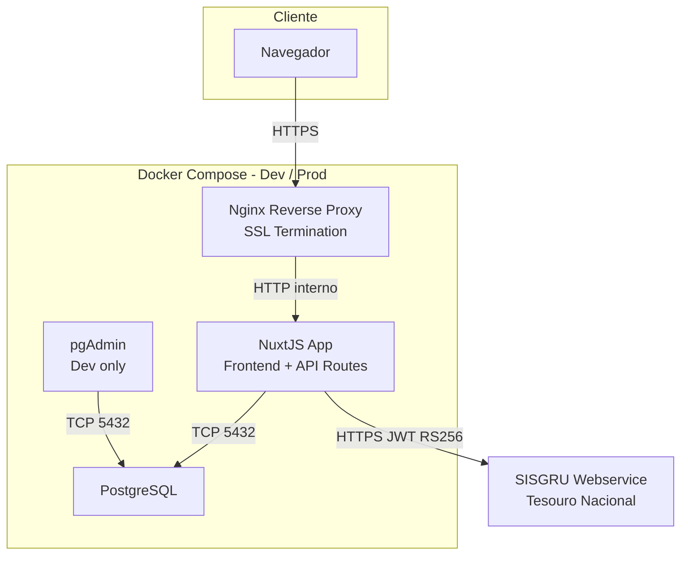
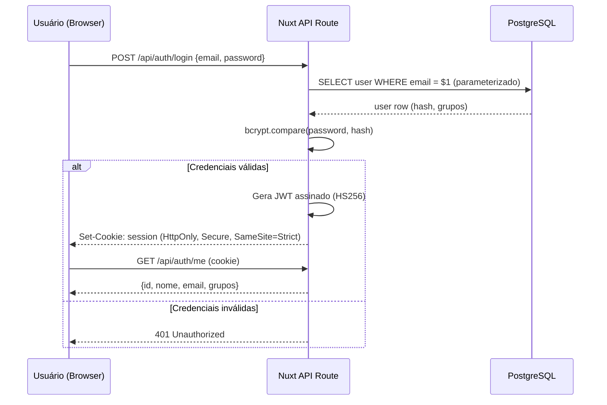
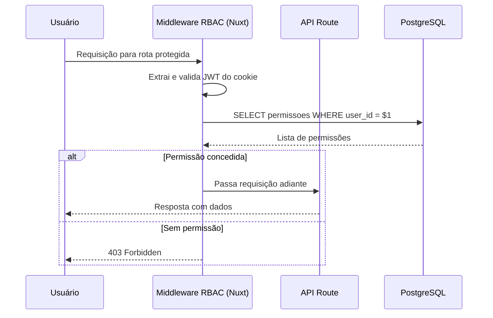
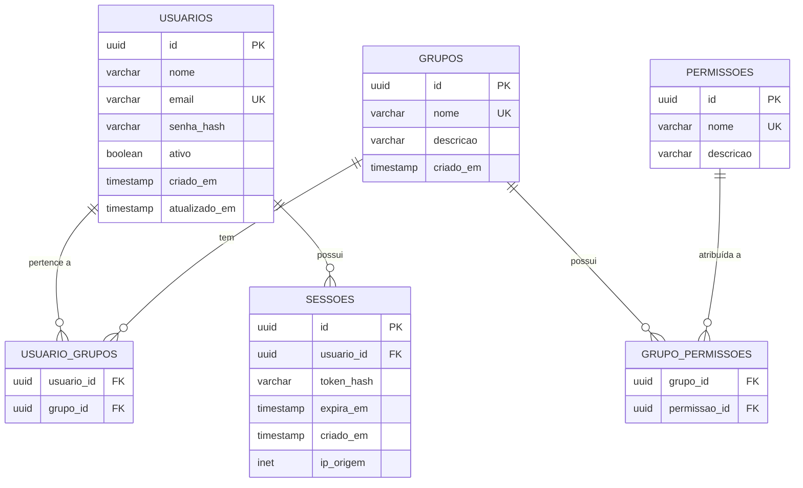
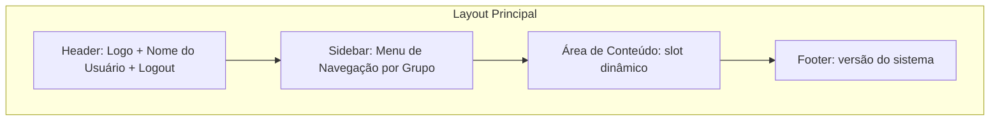
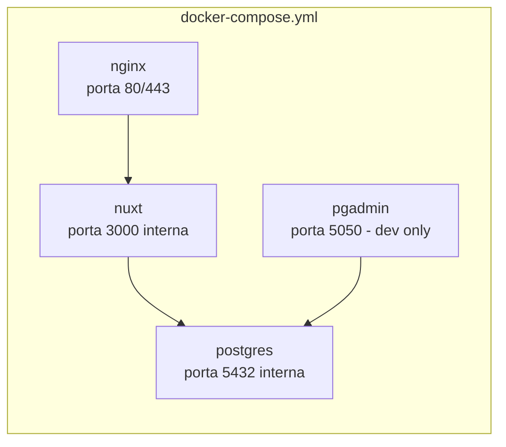
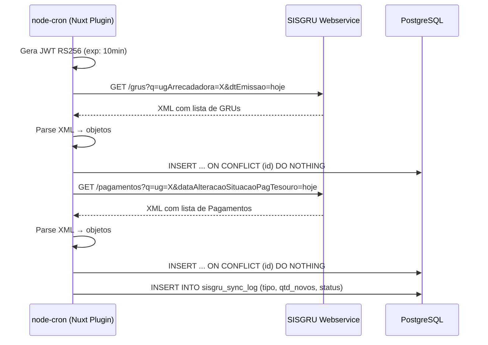
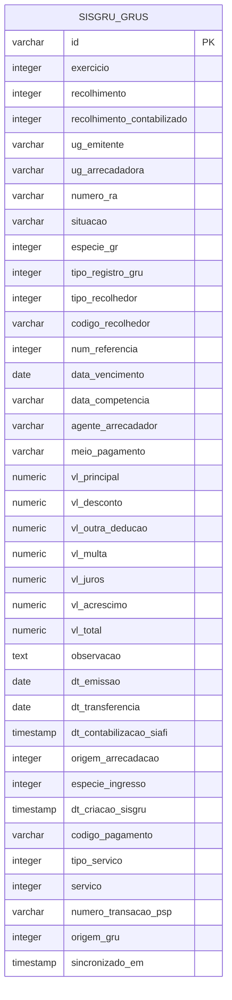
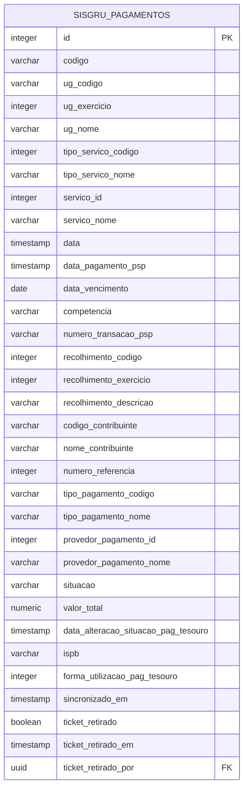

# Documento de Design: Sistema Tesouraria

## Visão Geral

O **Sistema Tesouraria** é uma aplicação web full-stack construída com NuxtJS (frontend + API), PostgreSQL como banco de dados relacional, Tailwind CSS com daisyUI (tema "emerald") para a interface, e infraestrutura containerizada via Docker Compose para ambientes de desenvolvimento e produção.

O sistema oferece autenticação segura, controle de acesso baseado em papéis (RBAC), e um template de navegação com menus e área de conteúdo. Inclui integração periódica com o webservice SISGRU (Tesouro Nacional) para sincronização de GRUs e Pagamentos. Toda a implementação segue as diretrizes de segurança OWASP, com proteção contra SQL Injection, XSS, CSRF e outras vulnerabilidades comuns. Todos os comandos e procedimentos de desenvolvimento são executados dentro do ambiente Docker dev.

---

## Arquitetura Geral



### Ambientes

| Aspecto | Desenvolvimento | Produção |
|---|---|---|
| SSL | Certificado autoassinado | Certificado do usuário (montado via volume) |
| pgAdmin | Habilitado | Desabilitado |
| Hot Reload | Habilitado (`nuxt dev`) | Desabilitado (`nuxt build` + `nuxt start`) |
| Secrets | `.env` local | `.env.prod` (não versionado) |

---

## Diagrama de Sequência — Autenticação



---

## Diagrama de Sequência — Controle de Acesso (RBAC)



---

## Componentes e Interfaces

### 1. Camada de Apresentação (Nuxt Pages + Components)

**Responsabilidades:**
- Renderizar o template com sidebar de menus e área de conteúdo
- Gerenciar estado de autenticação via composable `useAuth()`
- Aplicar tema daisyUI "emerald" globalmente

**Interface do composable `useAuth`:**

```typescript
interface AuthUser {
  id: string
  nome: string
  email: string
  grupos: string[]
}

interface UseAuth {
  user: Ref<AuthUser | null>
  isAuthenticated: ComputedRef<boolean>
  login(email: string, password: string): Promise<void>
  logout(): Promise<void>
  hasPermission(permissao: string): boolean
}
```

### 2. API Routes (Nuxt Server Routes)

**Responsabilidades:**
- Expor endpoints REST sob `/api/`
- Validar entrada com Zod antes de qualquer operação no banco
- Usar queries parametrizadas (nunca interpolação de strings SQL)
- Retornar erros genéricos ao cliente (sem stack traces)

**Endpoints principais:**

| Método | Rota | Descrição | Autenticação |
|---|---|---|---|
| POST | `/api/auth/login` | Autenticar usuário | Pública |
| POST | `/api/auth/logout` | Encerrar sessão | Autenticada |
| GET | `/api/auth/me` | Dados do usuário logado | Autenticada |
| GET | `/api/usuarios` | Listar usuários | Admin |
| POST | `/api/usuarios` | Criar usuário | Admin |
| GET | `/api/grupos` | Listar grupos/papéis | Admin |

### 3. Middleware de Autenticação e RBAC

**Responsabilidades:**
- Verificar JWT em cada requisição protegida
- Checar permissões do usuário contra a rota solicitada
- Bloquear acesso e registrar tentativas suspeitas

```typescript
interface PermissaoRota {
  rota: string
  metodo: string
  permissaoNecessaria: string
}

interface JWTPayload {
  sub: string       // user id
  email: string
  grupos: string[]
  iat: number
  exp: number
}
```

### 4. Camada de Acesso a Dados (Database Layer)

**Responsabilidades:**
- Abstrair queries PostgreSQL via `pg` (node-postgres)
- Garantir uso exclusivo de queries parametrizadas
- Gerenciar pool de conexões

```typescript
interface QueryResult<T> {
  rows: T[]
  rowCount: number
}

interface DatabaseClient {
  query<T>(sql: string, params: unknown[]): Promise<QueryResult<T>>
  transaction<T>(fn: (client: DatabaseClient) => Promise<T>): Promise<T>
}
```

---

## Modelos de Dados

### Diagrama Entidade-Relacionamento



### Regras de Validação

**USUARIOS:**
- `email`: formato válido, único, máx. 255 chars
- `senha_hash`: armazenado como bcrypt (custo ≥ 12), nunca texto plano
- `ativo`: padrão `true`; usuários inativos não podem autenticar

**GRUPOS:**
- `nome`: único, sem espaços, snake_case (ex: `admin`, `tesoureiro`)

**SESSOES:**
- `token_hash`: hash SHA-256 do JWT (não armazena o token bruto)
- `expira_em`: máx. 8 horas a partir da criação
- Sessões expiradas são limpas por job periódico

---

## Template de Interface (Layout)



**Estrutura de arquivos Nuxt:**

```
layouts/
  default.vue        ← layout autenticado (header + sidebar + content)
  auth.vue           ← layout público (só conteúdo centralizado)
pages/
  login.vue          ← usa layout auth
  index.vue          ← dashboard, usa layout default
  grus/
    index.vue        ← listagem de GRUs com filtro por dia
  pagamentos/
    index.vue        ← listagem de Pagamentos com filtro por dia
  reprografia/
    index.vue        ← baixa de créditos de impressão
  admin/
    usuarios.vue
    grupos.vue
    reprografia.vue  ← configuração do valor por cópia
components/
  AppSidebar.vue
  AppHeader.vue
  AppNavItem.vue
  sisgru/
    FiltroData.vue        ← seletor de data compartilhado
    TabelaGrus.vue        ← tabela de GRUs
    TabelaPagamentos.vue  ← tabela de Pagamentos
  reprografia/
    ConsultaCpf.vue       ← campo CPF + resultado de saldo
    FormBaixa.vue         ← formulário de número de cópias e botão de baixa
    TabelaUsos.vue        ← histórico de usos ordenado por data/hora
```

---

## Telas de Listagem SISGRU

### Tela: Listagem de GRUs (`/grus`)

Exibe os registros da tabela `sisgru_grus` filtrados por data de emissão (`dt_emissao`).

**Layout:**
```
┌─────────────────────────────────────────────────────────┐
│ GRUs                                    [Filtro: Data ▼] │
├─────────────────────────────────────────────────────────┤
│ ID          │ Recolhedor    │ Serviço │ Valor │ Situação │
│ 2026158...  │ 080.845...    │ 14671   │ R$60  │ 02       │
│ ...         │ ...           │ ...     │ ...   │ ...      │
├─────────────────────────────────────────────────────────┤
│ Total: N registros          Soma: R$ X.XXX,XX            │
└─────────────────────────────────────────────────────────┘
```

**Colunas exibidas:**

| Coluna | Campo DB | Observação |
|---|---|---|
| ID | `id` | |
| Nº RA | `numero_ra` | |
| Recolhedor | `codigo_recolhedor` | |
| Serviço | `servico` | |
| Tipo Serviço | `tipo_servico` | |
| Valor Total | `vl_total` | Formatado em R$ |
| Situação | `situacao` | |
| Dt. Emissão | `dt_emissao` | |
| Dt. Transferência | `dt_transferencia` | |
| Agente Arrecadador | `agente_arrecadador` | |
| Meio Pagamento | `meio_pagamento` | |

**Filtro:** seletor de data (padrão: hoje). Ao alterar a data, a tabela recarrega via `GET /api/sisgru/grus?data=DD/MM/YYYY`.

**Rodapé da tabela:** total de registros e soma de `vl_total`.

---

### Tela: Listagem de Pagamentos (`/pagamentos`)

Exibe os registros da tabela `sisgru_pagamentos` filtrados por `data_alteracao_situacao_pag_tesouro`.

**Layout:**
```
┌──────────────────────────────────────────────────────────────────┐
│ Pagamentos                                      [Filtro: Data ▼] │
├──────────────────────────────────────────────────────────────────┤
│ ID       │ Contribuinte     │ Serviço          │ Valor │ Situação │
│ 77136575 │ Luciane do N...  │ TICKET REFEIÇÃO  │ R$9   │ RE       │
│ ...      │ ...              │ ...              │ ...   │ ...      │
├──────────────────────────────────────────────────────────────────┤
│ Total: N registros               Soma: R$ X.XXX,XX               │
└──────────────────────────────────────────────────────────────────┘
```

**Colunas exibidas:**

| Coluna | Campo DB | Observação |
|---|---|---|
| ID | `id` | |
| Código | `codigo` | |
| Contribuinte | `nome_contribuinte` | |
| CPF/CNPJ | `codigo_contribuinte` | Mascarado: `***.XXX.XXX-**` |
| Serviço | `servico_nome` | |
| Recolhimento | `recolhimento_descricao` | |
| Valor Total | `valor_total` | Formatado em R$ |
| Situação | `situacao` | Badge colorido: CO=verde, RE=amarelo |
| Tipo Pagamento | `tipo_pagamento_nome` | |
| Data | `data` | |
| Dt. Alteração | `data_alteracao_situacao_pag_tesouro` | |
| Ticket | `ticket_retirado` | Apenas para `servico_id = 14671`; botão "Marcar Retirada" ou badge "Retirado" |

**Ação de ticket:** Para registros com `servico_id = 14671`, a coluna "Ticket" exibe:
- Se `ticket_retirado = false`: botão "Marcar Retirada" (chama `PATCH /api/sisgru/pagamentos/:id/ticket`)
- Se `ticket_retirado = true`: badge verde "Retirado" com tooltip mostrando data/hora e nome do servidor que marcou
- Para outros serviços: coluna vazia (N/A)

**Filtro:** seletor de data (padrão: hoje). Ao alterar a data, a tabela recarrega via `GET /api/sisgru/pagamentos?data=DD/MM/YYYY`.

**Rodapé da tabela:** total de registros e soma de `valor_total`.

---

### Endpoints de API para as Telas

| Método | Rota | Descrição | Autenticação |
|---|---|---|---|
| GET | `/api/sisgru/grus` | Lista GRUs por data (`?data=DD/MM/YYYY`) | Autenticada |
| GET | `/api/sisgru/pagamentos` | Lista Pagamentos por data (`?data=DD/MM/YYYY`) | Autenticada |
| PATCH | `/api/sisgru/pagamentos/:id/ticket` | Marca ticket como retirado (apenas `servico_id = 14671`) | Autenticada |
| GET | `/api/sisgru/sync-log` | Histórico de sincronizações | Admin |
| POST | `/api/sisgru/sync` | Dispara sincronização manual | Admin |
| GET | `/api/reprografia/creditos` | Consulta saldo por CPF (`?cpf=`) | Autenticada |
| POST | `/api/reprografia/usos` | Registra baixa de crédito | Autenticada |
| GET | `/api/reprografia/usos` | Lista usos/baixas (com filtros) | Autenticada |
| GET | `/api/reprografia/config` | Retorna configurações (valor por cópia) | Autenticada |
| PUT | `/api/reprografia/config` | Atualiza configurações | Admin |

---

## Telas de Reprografia

### Tela: Baixa de Créditos (`/reprografia`)

Usada pelo operador da reprografia para consultar saldo e registrar uso de cópias.

**Layout:**
```
┌─────────────────────────────────────────────────────────────┐
│ Reprografia                                                  │
├─────────────────────────────────────────────────────────────┤
│ CPF: [___.___.___-__]  [Consultar]                          │
│                                                              │
│ Nome: Fulano de Tal                                          │
│ Saldo disponível: R$ 12,50                                   │
│                                                              │
│ Nº de cópias: [____]   Valor/cópia: R$ 0,10                 │
│ Total a descontar: R$ X,XX                                   │
│ [Registrar Baixa]                                            │
├─────────────────────────────────────────────────────────────┤
│ Histórico de usos (ordenado por data/hora desc)             │
│ Data/Hora  │ CPF        │ Nome     │ Cópias │ Valor │ Saldo │
│ 25/03 10:30│ ***.123... │ Fulano   │ 10     │ R$1,00│ R$11,50│
│ ...        │ ...        │ ...      │ ...    │ ...   │ ...   │
└─────────────────────────────────────────────────────────────┘
```

**Fluxo:**
1. Operador informa o CPF e clica "Consultar" → `GET /api/reprografia/creditos?cpf=XXX`
2. Sistema exibe nome e saldo disponível
3. Operador informa número de cópias; sistema calcula total a descontar em tempo real
4. Operador clica "Registrar Baixa" → `POST /api/reprografia/usos`
5. Sistema valida saldo suficiente, registra em `reprografia_usos`, debita de `reprografia_creditos` e atualiza a tabela de histórico

**Validações:**
- CPF deve existir em `reprografia_creditos`
- Número de cópias deve ser inteiro positivo
- `num_copias * valor_por_copia` não pode exceder o saldo disponível

---

### Tela: Administração de Reprografia (`/admin/reprografia`)

Permite ao administrador configurar o valor por cópia.

**Layout:**
```
┌─────────────────────────────────────────────────────────────┐
│ Configurações de Reprografia                                 │
├─────────────────────────────────────────────────────────────┤
│ Valor por cópia (R$): [0,10]   [Salvar]                     │
│ Última atualização: 25/03/2026 por Admin                    │
└─────────────────────────────────────────────────────────────┘
```

---

## Infraestrutura Docker Compose



**Volumes e segredos:**

| Volume / Secret | Dev | Prod |
|---|---|---|
| `./ssl/dev/` | Cert autoassinado gerado no build | — |
| `./ssl/prod/` | — | Cert do usuário (montado, não versionado) |
| `postgres_data` | Volume nomeado | Volume nomeado |
| `.env` | Variáveis de dev | Não usado |
| `.env.prod` | Não usado | Variáveis de prod (não versionado) |

---

## Integração SISGRU

### Visão Geral

O sistema consulta periodicamente dois endpoints do webservice SISGRU (`https://webservice.sisgru.tesouro.gov.br/sisgru/services/v1`) para sincronizar dados de GRUs e Pagamentos. A autenticação é feita via JWT assinado com chave privada RSA (RS256), conforme o padrão do SISGRU.

### Mecanismo de Sincronização

A sincronização é implementada como um **Nuxt Server Plugin** com `node-cron`, executado dentro do container da aplicação. Isso evita dependência de cron externo e mantém tudo dentro do ambiente Docker.

**Intervalo padrão:** 10 minutos (parametrizado via variável de ambiente `SISGRU_SYNC_INTERVAL_MINUTES`)



### Configuração (variáveis de ambiente)

| Variável | Descrição | Exemplo |
|---|---|---|
| `SISGRU_URL_BASE` | URL base do webservice | `https://webservice.sisgru.tesouro.gov.br/sisgru/services/v1` |
| `SISGRU_ISSUER` | Identificador do emissor JWT | `tesouraria` |
| `SISGRU_PRIVATE_KEY_PATH` | Caminho da chave privada RSA dentro do container | `/run/secrets/sisgru.key` |
| `SISGRU_UG` | Código da UG arrecadadora | `158461` |
| `SISGRU_SYNC_INTERVAL_MINUTES` | Intervalo de sincronização em minutos | `10` |

A chave privada é montada via volume Docker (não versionada). O caminho é configurável para facilitar diferentes ambientes.

### Endpoints Consultados

| Endpoint | Filtro principal | Descrição |
|---|---|---|
| `GET /grus` | `ugArrecadadora`, `dtEmissao` (dia atual) | GRUs emitidas no dia |
| `GET /pagamentos` | `ug`, `dataAlteracaoSituacaoPagTesouro` (dia atual) | Pagamentos alterados no dia |

### Modelos de Dados — SISGRU

#### Tabela `sisgru_grus`

Armazena todos os campos retornados pelo endpoint `/grus`:



#### Tabela `sisgru_pagamentos`

Armazena todos os campos retornados pelo endpoint `/pagamentos`:



**Campos de controle de ticket:**
- `ticket_retirado`: padrão `false`; `true` indica que o ticket de alimentação foi retirado pelo beneficiário
- `ticket_retirado_em`: timestamp do momento da marcação
- `ticket_retirado_por`: FK para `usuarios.id` — servidor que realizou a marcação
- Apenas registros com `servico_id = 14671` (TICKET REFEIÇÃO) possuem semântica para esses campos

#### Tabela `reprografia_creditos`

Armazena o saldo acumulado de créditos de impressão por CPF. Atualizada a cada sincronização SISGRU quando `servico_id = 16279`.

```sql
CREATE TABLE reprografia_creditos (
    cpf             VARCHAR(14) PRIMARY KEY,  -- codigoContribuinte
    nome            VARCHAR(255) NOT NULL,    -- nomeContribuinte (atualizado a cada sync)
    saldo           NUMERIC(10,2) NOT NULL DEFAULT 0,
    atualizado_em   TIMESTAMP NOT NULL DEFAULT NOW()
);
```

**Regra:** `INSERT ... ON CONFLICT (cpf) DO UPDATE SET saldo = saldo + EXCLUDED.saldo, nome = EXCLUDED.nome, atualizado_em = NOW()` — acumula o `valorTotal` de cada pagamento 16279 sincronizado.

#### Tabela `reprografia_usos`

Registra cada baixa de crédito realizada pelo operador da reprografia.

```sql
CREATE TABLE reprografia_usos (
    id              SERIAL PRIMARY KEY,
    cpf             VARCHAR(14) NOT NULL REFERENCES reprografia_creditos(cpf),
    nome            VARCHAR(255) NOT NULL,
    num_copias      INTEGER NOT NULL CHECK (num_copias > 0),
    valor_por_copia NUMERIC(10,4) NOT NULL,  -- snapshot do valor vigente no momento
    valor_total     NUMERIC(10,2) NOT NULL,  -- num_copias * valor_por_copia
    saldo_anterior  NUMERIC(10,2) NOT NULL,
    saldo_posterior NUMERIC(10,2) NOT NULL,
    operador_id     UUID NOT NULL REFERENCES usuarios(id),
    registrado_em   TIMESTAMP NOT NULL DEFAULT NOW()
);
```

#### Tabela `reprografia_config`

Armazena parâmetros configuráveis da reprografia (valor por cópia).

```sql
CREATE TABLE reprografia_config (
    chave       VARCHAR(50) PRIMARY KEY,
    valor       VARCHAR(255) NOT NULL,
    descricao   VARCHAR(255),
    atualizado_em TIMESTAMP NOT NULL DEFAULT NOW(),
    atualizado_por UUID REFERENCES usuarios(id)
);
-- Registro inicial: ('valor_por_copia', '0.10', 'Valor cobrado por cópia em R$')
```

#### Tabela `sisgru_sync_log`

Registra cada execução de sincronização para auditoria e monitoramento:

```sql
CREATE TABLE sisgru_sync_log (
    id          SERIAL PRIMARY KEY,
    tipo        VARCHAR(20) NOT NULL,  -- 'grus' ou 'pagamentos'
    iniciado_em TIMESTAMP NOT NULL DEFAULT NOW(),
    finalizado_em TIMESTAMP,
    qtd_novos   INTEGER,
    qtd_total   INTEGER,
    status      VARCHAR(20) NOT NULL,  -- 'sucesso', 'erro'
    mensagem_erro TEXT
);
```

### Regras de Sincronização

- **Deduplicação GRUs/Pagamentos:** `INSERT ... ON CONFLICT (id) DO NOTHING`
- **Créditos reprografia:** ao sincronizar pagamentos com `servico_id = 16279`, acumular `valorTotal` em `reprografia_creditos` via `INSERT ... ON CONFLICT (cpf) DO UPDATE SET saldo = saldo + EXCLUDED.saldo`
- **Escopo temporal:** consulta sempre o dia atual (data do servidor)
- **Falha isolada:** erro em um endpoint não cancela o outro; ambos são logados independentemente
- **Chave privada:** nunca versionada; montada via volume Docker em `/run/secrets/sisgru.key`
- **JWT SISGRU:** RS256, `exp` de 10 minutos, gerado a cada execução do cron

### Interface TypeScript

```typescript
interface SisgruGru {
  id: string
  exercicio: number
  recolhimento: number
  recolhimentoContabilizado: number
  ugEmitente: string
  ugArrecadadora: string
  numeroRa: string
  situacao: string
  especieGr: number
  tipoRegistroGru: number
  tipoRecolhedor: number
  codigoRecolhedor: string
  numReferencia?: number
  dataVencimento?: string
  dataCompetencia?: string
  agenteArrecadador: string
  meioPagamento: string
  vlPrincipal: number
  vlDesconto: number
  vlOutraDeducao: number
  vlMulta: number
  vlJuros: number
  vlAcrescimo: number
  vlTotal: number
  observacao?: string
  dtEmissao: string
  dtTransferencia?: string
  dtContabilizacaoSiafi?: string
  origemArrecadacao: number
  especieIngresso: number
  dtCriacaoSisgru: string
  codigoPagamento: string
  tipoServico: number
  servico: number
  numeroTransacaoPsp?: string
  origemGru: number
}

interface SisgruPagamento {
  id: number
  codigo: string
  ugCodigo: string
  ugExercicio: number
  ugNome: string
  tipoServicoCodigo: number
  tipoServicoNome: string
  servicoId: number
  servicoNome: string
  data: string
  dataPagamentoPsp?: string
  dataVencimento?: string
  competencia?: string
  numeroTransacaoPsp?: string
  recolhimentoCodigo: number
  recolhimentoExercicio: number
  recolhimentoDescricao: string
  codigoContribuinte: string
  nomeContribuinte: string
  numeroReferencia?: number
  tipoPagamentoCodigo: string
  tipoPagamentoNome: string
  provedorPagamentoId: number
  provedorPagamentoNome: string
  situacao: string
  valorTotal: number
  dataAlteracaoSituacaoPagTesouro: string
  ispb?: string
  formaUtilizacaoPagTesouro: number
}

interface SisgruSyncService {
  syncGrus(data: string): Promise<{ novos: number; total: number }>
  syncPagamentos(data: string): Promise<{ novos: number; total: number }>
  syncDia(data?: string): Promise<void>
}
```

---

## Tratamento de Erros

### Cenário 1: Credenciais inválidas no login
- **Condição:** Email não encontrado ou senha incorreta
- **Resposta:** HTTP 401, mensagem genérica ("Credenciais inválidas") — sem distinguir qual campo falhou
- **Recuperação:** Rate limiting por IP após 5 tentativas em 10 minutos

### Cenário 2: Token JWT expirado ou inválido
- **Condição:** Cookie de sessão ausente, adulterado ou expirado
- **Resposta:** HTTP 401, redirect para `/login` no frontend
- **Recuperação:** Usuário refaz login

### Cenário 3: Acesso sem permissão
- **Condição:** Usuário autenticado tenta acessar recurso sem permissão
- **Resposta:** HTTP 403, página de erro amigável
- **Recuperação:** Usuário é redirecionado ao dashboard

### Cenário 4: Erro de banco de dados
- **Condição:** Falha de conexão ou query inválida
- **Resposta:** HTTP 500, mensagem genérica ao cliente; erro completo apenas nos logs do servidor
- **Recuperação:** Retry automático via pool de conexões

### Cenário 5: Falha na sincronização SISGRU
- **Condição:** Timeout, erro HTTP, XML malformado ou chave privada inválida
- **Resposta:** Erro registrado em `sisgru_sync_log` com `status = 'erro'` e `mensagem_erro`; próxima execução do cron tenta novamente
- **Recuperação:** Automática na próxima janela do cron; sem impacto na disponibilidade da aplicação

### Cenário 6: Chave privada SISGRU ausente
- **Condição:** Arquivo de chave não montado no container
- **Resposta:** Sincronização desabilitada com log de erro crítico na inicialização; aplicação continua funcionando normalmente
- **Recuperação:** Montar o volume correto e reiniciar o container

---

## Estratégia de Testes

### Testes Unitários
- Funções de validação de entrada (Zod schemas)
- Lógica de verificação de permissões RBAC
- Utilitários de hash e JWT

### Testes de Propriedade (Property-Based)
- **Biblioteca:** `fast-check`
- Propriedade: qualquer string arbitrária como senha nunca é armazenada em texto plano
- Propriedade: queries parametrizadas nunca produzem SQL com interpolação de variáveis

### Testes de Integração
- Fluxo completo de login → acesso a rota protegida → logout
- Tentativa de acesso com token adulterado → 401
- Tentativa de acesso sem permissão → 403

---

## Considerações de Segurança (OWASP)

| Ameaça OWASP | Mitigação |
|---|---|
| A01 - Broken Access Control | RBAC com verificação server-side em toda rota protegida |
| A02 - Cryptographic Failures | bcrypt (custo ≥ 12) para senhas; HTTPS obrigatório; cookies HttpOnly + Secure |
| A03 - Injection (SQL) | Queries parametrizadas exclusivamente; validação de entrada com Zod |
| A05 - Security Misconfiguration | `.gitignore` bloqueia `.env*`, `ssl/`, `*.pem`, `*.key`; segredos via variáveis de ambiente |
| A07 - Auth Failures | Rate limiting no login; tokens com expiração curta; invalidação de sessão no logout |
| A09 - Logging Failures | Logs de autenticação e erros no servidor; sem dados sensíveis nos logs |

---

## Dependências

| Dependência | Versão alvo | Finalidade |
|---|---|---|
| `nuxt` | 3.x | Framework full-stack |
| `@nuxtjs/tailwindcss` | latest | Integração Tailwind |
| `daisyui` | latest | Componentes UI (tema emerald) |
| `pg` | latest | Cliente PostgreSQL |
| `bcryptjs` | latest | Hash de senhas |
| `jsonwebtoken` | latest | Geração/validação JWT |
| `zod` | latest | Validação de schemas |
| `fast-check` | latest | Testes de propriedade |
| `vitest` | latest | Runner de testes |
| `node-cron` | latest | Agendamento de sincronização SISGRU |
| `xml2js` | latest | Parse de XML retornado pelo SISGRU |
| Docker + Compose | v2+ | Containerização |
| Nginx | alpine | Reverse proxy + SSL |


---

## Propriedades de Corretude

*Uma propriedade é uma característica ou comportamento que deve ser verdadeiro em todas as execuções válidas do sistema — essencialmente, uma declaração formal sobre o que o sistema deve fazer. As propriedades servem como ponte entre especificações legíveis por humanos e garantias de corretude verificáveis por máquina.*

### Propriedade 1: Autenticação válida sempre produz cookie com flags de segurança

*Para qualquer* par (email, senha) de usuário ativo e válido, o resultado de `POST /api/auth/login` deve sempre ser um cookie de sessão com as flags `HttpOnly`, `Secure` e `SameSite=Strict` presentes.

**Validates: Requirements 1.1, 13.1**

---

### Propriedade 2: Credenciais inválidas sempre retornam 401 com mensagem genérica

*Para qualquer* par (email, senha) que não corresponda a um usuário ativo no banco, a resposta de `POST /api/auth/login` deve ser HTTP 401 com a mesma mensagem genérica, sem distinguir qual campo falhou e sem revelar detalhes internos.

**Validates: Requirements 1.2, 1.8**

---

### Propriedade 3: Login seguido de logout invalida a sessão (round-trip)

*Para qualquer* usuário válido, realizar login seguido de logout deve resultar em sessão inválida: qualquer requisição subsequente com o cookie da sessão encerrada deve retornar HTTP 401.

**Validates: Requirements 1.4, 11.2**

---

### Propriedade 4: Senhas nunca armazenadas em texto plano

*Para qualquer* string de senha fornecida no cadastro ou login, o valor armazenado na coluna `senha_hash` da tabela `usuarios` deve ser diferente da senha original e deve ser um hash bcrypt válido com custo mínimo 12.

**Validates: Requirements 1.5, 4.2**

---

### Propriedade 5: Token de sessão armazenado apenas como hash SHA-256

*Para qualquer* JWT gerado pelo Auth_Service, o valor armazenado em `sessoes.token_hash` deve ter exatamente 64 caracteres hexadecimais (SHA-256) e ser diferente do JWT original.

**Validates: Requirements 1.6**

---

### Propriedade 6: Sessões expiradas são sempre rejeitadas

*Para qualquer* sessão com `expira_em` anterior ao momento atual, qualquer requisição autenticada usando essa sessão deve retornar HTTP 401.

**Validates: Requirements 1.7**

---

### Propriedade 7: Rate limiting bloqueia após excesso de tentativas falhas

*Para qualquer* endereço IP, após mais de 5 tentativas de login com falha em uma janela de 10 minutos, todas as tentativas subsequentes nessa janela devem retornar HTTP 429.

**Validates: Requirements 2.1, 2.2**

---

### Propriedade 8: RBAC bloqueia tokens inválidos com 401

*Para qualquer* rota protegida e qualquer token JWT ausente, adulterado ou expirado, o RBAC_Middleware deve retornar HTTP 401 sem processar a requisição.

**Validates: Requirements 3.1, 3.3**

---

### Propriedade 9: RBAC bloqueia usuários sem permissão com 403

*Para qualquer* rota protegida e qualquer usuário autenticado cujo conjunto de permissões não inclua a permissão necessária para aquela rota, o RBAC_Middleware deve retornar HTTP 403.

**Validates: Requirements 3.2, 3.4, 4.4, 12.5**

---

### Propriedade 10: Validação Zod rejeita entradas inválidas antes de qualquer query

*Para qualquer* entrada que não satisfaça o schema Zod de uma API Route, a resposta deve ser HTTP 400 sem que nenhuma query seja executada no Database, e o corpo da resposta não deve conter stack traces ou detalhes internos.

**Validates: Requirements 5.1, 5.3, 4.5, 12.6**

---

### Propriedade 11: Queries parametrizadas neutralizam SQL Injection

*Para qualquer* string de entrada contendo caracteres especiais SQL (aspas, ponto-e-vírgula, palavras-chave SQL), a execução da query parametrizada deve tratar a string como dado literal, sem alterar a estrutura da query ou o estado do banco de forma não intencional.

**Validates: Requirements 5.2**

---

### Propriedade 12: Erros internos nunca expõem detalhes ao cliente

*Para qualquer* erro interno do servidor (falha de banco, exceção não tratada), a resposta HTTP ao cliente deve conter apenas uma mensagem genérica, sem stack traces, nomes de tabelas, queries ou qualquer detalhe de implementação.

**Validates: Requirements 5.4, 13.3, 14.3**

---

### Propriedade 13: JWT SISGRU sempre gerado com RS256 e expiração de 10 minutos

*Para qualquer* execução do SISGRU_Sync, o JWT gerado para autenticação no SISGRU_Webservice deve ter `alg=RS256`, `exp = iat + 600` (10 minutos) e ser assinado com a chave privada RSA configurada.

**Validates: Requirements 7.2**

---

### Propriedade 14: Sincronização SISGRU é idempotente (deduplicação)

*Para qualquer* conjunto de registros XML retornados pelo SISGRU_Webservice, executar a sincronização duas ou mais vezes deve resultar no mesmo estado do banco de dados que executar uma única vez — registros duplicados são descartados silenciosamente via `INSERT ... ON CONFLICT (id) DO NOTHING`.

**Validates: Requirements 7.5, 7.9**

---

### Propriedade 15: Toda execução de sincronização é registrada na Sync_Log

*Para qualquer* execução do SISGRU_Sync (com sucesso ou com erro), deve existir um registro na tabela `sisgru_sync_log` contendo `tipo`, `iniciado_em`, `finalizado_em`, `qtd_novos`, `qtd_total`, `status` e, quando aplicável, `mensagem_erro`.

**Validates: Requirements 7.6, 14.2**

---

### Propriedade 16: Falha em um endpoint SISGRU não cancela o outro

*Para qualquer* execução do SISGRU_Sync onde um dos endpoints (GRUs ou Pagamentos) falha, o outro endpoint deve ser executado independentemente, e ambos devem ter seus resultados registrados separadamente na Sync_Log.

**Validates: Requirements 7.7**

---

### Propriedade 17: Round-trip de parse/serialização SISGRU preserva todos os campos

*Para qualquer* objeto `SisgruGru` ou `SisgruPagamento` válido, o ciclo completo de serialização para XML → parse do XML → serialização para inserção no Database → recuperação do Database deve produzir um objeto equivalente ao original, com todos os campos preservados nos tipos corretos.

**Validates: Requirements 8.1, 8.2, 8.3, 8.4**

---

### Propriedade 18: XML malformado não resulta em inserção parcial

*Para qualquer* XML malformado ou incompleto retornado pelo SISGRU_Webservice, nenhum registro parcial deve ser inserido no Database, e o erro deve ser registrado na Sync_Log com `status = 'erro'`.

**Validates: Requirements 8.5**

---

### Propriedade 19: Filtro por data retorna apenas registros da data selecionada

*Para qualquer* data válida no formato `DD/MM/YYYY` fornecida como parâmetro em `GET /api/sisgru/grus` ou `GET /api/sisgru/pagamentos`, todos os registros retornados devem ter o campo de data correspondente (`dt_emissao` ou `data_alteracao_situacao_pag_tesouro`) igual à data informada, e nenhum registro de outra data deve ser incluído.

**Validates: Requirements 9.2, 10.2, 12.1, 12.2**

---

### Propriedade 20: Totalizadores calculados corretamente para qualquer conjunto de registros

*Para qualquer* conjunto de registros retornados pelas telas de GRUs ou Pagamentos, o total exibido no rodapé deve ser igual à contagem de registros e a soma exibida deve ser igual à soma aritmética dos valores (`vl_total` ou `valor_total`) de todos os registros retornados.

**Validates: Requirements 9.4, 10.4**

---

### Propriedade 21: Máscara de CPF/CNPJ aplicada a todos os registros de Pagamentos

*Para qualquer* registro de Pagamento exibido na tabela, o campo `codigo_contribuinte` deve ser renderizado no formato mascarado `***.XXX.XXX-**`, nunca expondo os dígitos protegidos.

**Validates: Requirements 10.3**

---

### Propriedade 22: Sidebar exibe apenas itens autorizados para o usuário

*Para qualquer* usuário autenticado com conjunto de permissões P, o sidebar do Layout_Principal deve exibir apenas itens de menu que requerem permissões contidas em P, sem exibir itens de rotas para as quais o usuário não tem acesso.

**Validates: Requirements 11.5**

---

### Propriedade 23: Logs de autenticação nunca contêm senhas ou tokens

*Para qualquer* tentativa de autenticação (sucesso ou falha), o registro de log gerado pelo Auth_Service deve conter o evento e o IP de origem, mas não deve conter a senha fornecida, o token JWT gerado, nem o hash da sessão.

**Validates: Requirements 14.1**

---

### Propriedade 24: ip_origem sempre preenchido em novas sessões

*Para qualquer* sessão criada com sucesso no Database, o campo `ip_origem` da tabela `sessoes` deve estar preenchido com o endereço IP da requisição de login que originou a sessão.

**Validates: Requirements 14.4**

---

### Propriedade 25: Marcação de ticket é idempotente e restrita ao serviço 14671

*Para qualquer* registro de `sisgru_pagamentos`, chamar `PATCH /api/sisgru/pagamentos/:id/ticket` deve:
- Ter sucesso apenas se `servico_id = 14671` e `ticket_retirado = false`
- Retornar HTTP 422 se `servico_id ≠ 14671` ou se `ticket_retirado` já é `true`
- Nunca alterar `ticket_retirado_por` ou `ticket_retirado_em` de uma marcação já existente

**Validates: Requirements 15.4, 15.5, 15.6**

---

### Propriedade 26: Marcação de ticket registra auditoria completa

*Para qualquer* marcação bem-sucedida via `PATCH /api/sisgru/pagamentos/:id/ticket`, o Database deve conter `ticket_retirado = true`, `ticket_retirado_em` com timestamp não nulo e `ticket_retirado_por` igual ao `id` do usuário autenticado que realizou a operação.

**Validates: Requirements 15.5**

---

### Propriedade 27: Créditos de reprografia acumulam corretamente na sincronização

*Para qualquer* conjunto de pagamentos com `servico_id = 16279` retornados pelo SISGRU_Webservice, após a sincronização o saldo em `reprografia_creditos` para cada CPF deve ser igual à soma de todos os `valorTotal` dos pagamentos daquele CPF com `servico_id = 16279` que ainda não foram sincronizados anteriormente.

**Validates: Requirements 16.1, 16.2**

---

### Propriedade 28: Baixa de reprografia nunca resulta em saldo negativo

*Para qualquer* operação de baixa via `POST /api/reprografia/usos`, se `num_copias * valor_por_copia > saldo_disponivel`, a operação deve ser rejeitada com HTTP 422 e o saldo em `reprografia_creditos` não deve ser alterado.

**Validates: Requirements 17.4**

---

### Propriedade 29: Baixa de reprografia é atômica

*Para qualquer* operação de baixa bem-sucedida, o registro em `reprografia_usos` e o débito em `reprografia_creditos.saldo` devem ocorrer na mesma transação de banco de dados — ou ambos persistem ou nenhum persiste.

**Validates: Requirements 17.3, 17.5**

---

### Propriedade 30: Snapshot do valor por cópia é preservado no histórico

*Para qualquer* registro em `reprografia_usos`, o campo `valor_por_copia` deve refletir o valor vigente em `reprografia_config` no momento da baixa, independentemente de alterações posteriores na configuração.

**Validates: Requirements 17.6**

*Para qualquer* marcação bem-sucedida via `PATCH /api/sisgru/pagamentos/:id/ticket`, o Database deve conter `ticket_retirado = true`, `ticket_retirado_em` com timestamp não nulo e `ticket_retirado_por` igual ao `id` do usuário autenticado que realizou a operação.

**Validates: Requirements 15.5**
